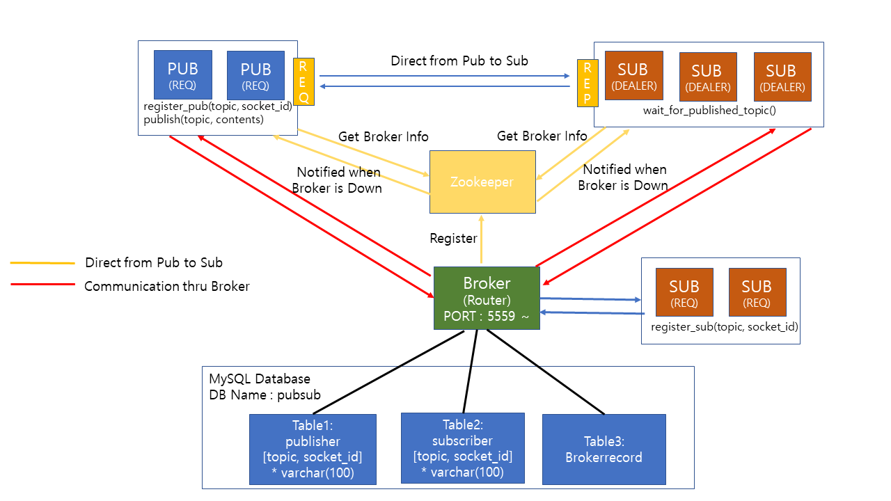
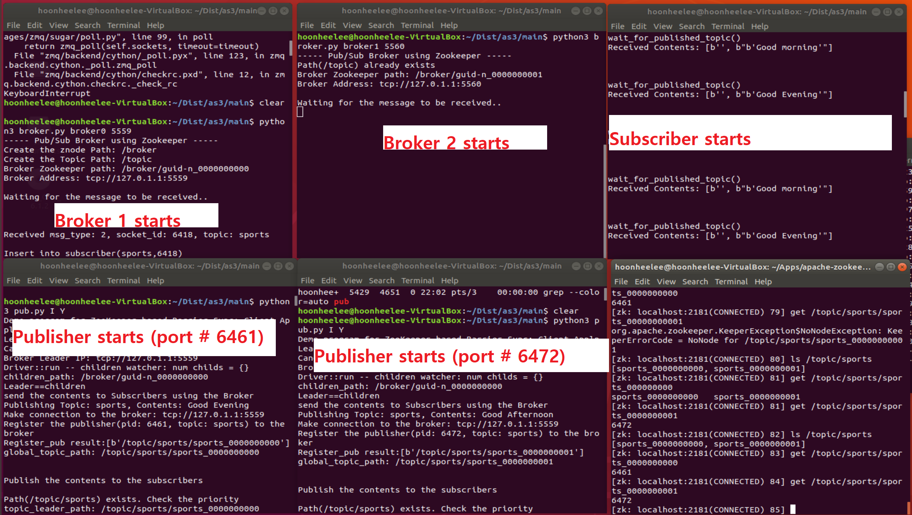
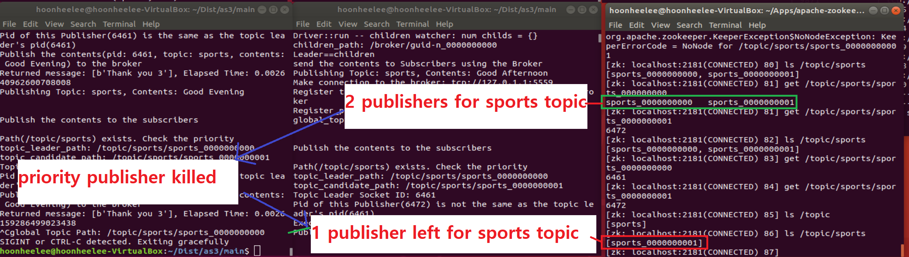
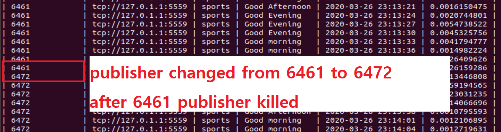
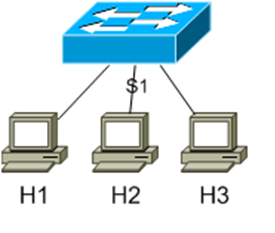
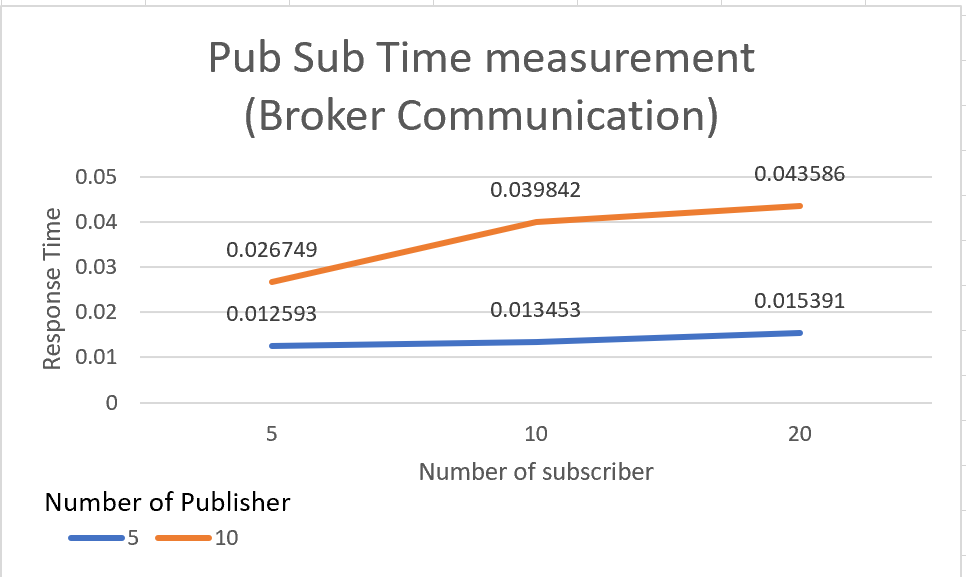
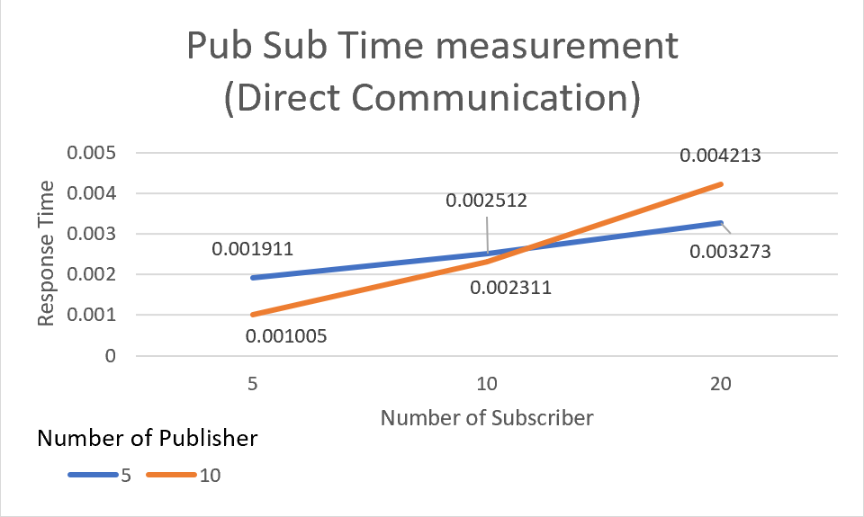

**Vanderbilt University**

**2020 Distributed Systems Principles(CS6381) Assignment3 : Pub/Sub Model Implementation : Publisher Ownership

## System Diagram - No structural change from Assignment2


## How to Execute
**0. Prerequirement**
 - Mysql Database
  - user information : ID - 'lhh@localhost', PW - '1234'
  - Database Name : pubsub
  - Table Information
     1. publisher
        -- create table publisher(topic varchar(100), socket_id varchar(100));
        
     2. subscriber
        -- create table subscriber(topic varchar(100), socket_id varchar(100));
  
     3. brokerrecord
        -- create table brokerrecord(publisher_port varchar(10), broker_address varchar(100), topic varchar(100), contents varchar(1000), start_time timestamp, elapsed_time FLOAT(20,10));


**1. Zookeeper tasks**
 
 Start Zookeeper
 - $ zkServer.sh start
 Connect to Zookeeper
 - $ zkCli.sh
 delete 'broker' node if exists
 - [zk: localhost:2181(CONNECTED) 0] deleteall /broker
 ```diff
- text in red
 delete 'topic' node if exists
 - [zk: localhost:2181(CONNECTED) 0] deleteall /topic
 ```
 
 
**2-1. Publisher to Subscribers using Broker**

* broker's IP address and Port number are required
 Execute the Broker
 - $ python3 broker.py broker0 5559
     - broker0 : zookeeper node name
     - 5559 : port number of this broker
 Execute the Subscriber
 - $ python3 sub.py I
     - I : Indirect communication (Using Broker)
 Execute the Publisher
 - $ python3 pub.py I Y
     - I : Indirect communication (Using Broker)
     - Y : Automatic execution (if 'N': you can put in the topic and contents yourself)


**2-2. Directly from Publisher to Subscribers**

 Execute the Broker
 - $ python3 broker.py broker0 5559
     - broker0 : zookeeper node name
     - 5559 : port number of this broker
 Execute the Subscriber
 - $ python3 sub.py D
     - D : Direct communication between subscriber and publisher
 Execute the Publisher
 - $ python3 pub.py D Y
     - D : Direct communication between subscriber and publisher
     - Y : Automatic execution (if 'N': you can put in the topic and contents yourself)
     
** How to use command generator(pubsubgen.py)
$ python3 pubsubgen.py I 5 10 20 Y
  - I : Indirect communication (Using Broker), if 'D' Direct communication
  - 5 : # of brokers
  - 10 : # of publishers
  - 20 : # of subscribers
  - Y : Publisher Automatic execution (if 'N': you can put in the topic and contents yourself)
  --> Output : broker_command.txt, publisher_command.txt, subscriber_command.txt
 
 ## Demo Screenshots
  1. Broker starts : start 2 brokers
 
 
 
 
  2. Subscribers start : start 2 subscribers
  
  
  
  
  3. Publisher starts : start 1 publisher
  
  
  
  4. publisher publishes : publisher send a content
  
  
  
  
  5. Broker die1/3 : Zookeeper notification 
  
  
  
  
    6. Broker die2/3 : Zookeeper leader change
  
  
  
  
    5. Broker die3/3 : different broker starts working(evidenced by the DB transaction record)
  
  
 
 
 ## Testing Environment
 
  - Minimal 3 client Topology
  
  * You can make your own topology and execute this program
  
  
 ## Time measurement
 
 We could get almost the same result as that of assignment #1
 
 * Broker Communication


 * Direct Communication

